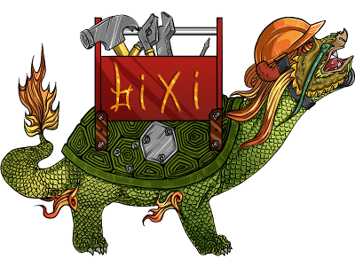

# Bixi
\
C89 basic types and functions library for Linux, BSD and Minix operation systems.

# Origins of the name
\
Bixi or Bi Xi (Wade–Giles: Pi-hsi), is a figure from Chinese mythology. One of the 9 sons of the Dragon King, he is depicted as a dragon with the shell of a turtle. Stone sculptures of Bixi have been used in Chinese culture for centuries as a decorative plinth for commemorative steles and tablets, particularly in the funerary complexes of its later emperors and to commemorate important events, such as an imperial visit or the anniversary of a World War II victory. They are also used at the bases of bridges and archways. Sculptures of Bixi are traditionally rubbed for good luck, which can cause conservation issues. They can be found throughout East Asia in Japan, Korea, Vietnam, Mongolia, and even the Russian Far East.\
_(from wikipedia.org)_\
The name Bixi was selected to symbolise the basis of any solid and reliable library.

# Basic functionality
The Bixi library provides basic fixed-sized types, functions to translate them to byte-sequences or strings and vice-versa, hash functions, little-to-big and vice-versa translators, bit tricks functions, mem* family functions that in opposite stdlib's ones make checks before the actions, sleep* family functions which can receive nano-, micro-, milli-, seconds or even float values, pack of constants for time calculations, pack of constants for colours managements, safe-string functions and so on.

# Dependencies to standart library

The Bixi library has *no* dependencies.

# Defined types

Libbixi provides basic types with the fixed size:
```c
 u8,  i8,
u16, i16,
u32, i32,
f32, f64
```
Also there are semantic wrappers that simplify the work with the non-native endings:
```c
i16_le;
i16_be;
u16_le;
u16_be;
i32_le;
i32_be;
u32_le;
u32_be;
```
Limits for every type (like `I32_LE_MAX`) included.

There are two bool-resulting macros for current arch check:
```
IS_BE
IS_LE
```

# Compile time assert

The library also provides compile-time assert that can provide build-time checks, like related with sizeof or defined macro:
```c
COMPILE_ASSERT(sizeof(u32) == 4);
COMPILE_ASSERT(DEFINEDCORPSTARNDART == 19901002);
```
# Boolean types

As the c89\\90 does not include boolean support, the library provides one:
```c
#ifndef __cplusplus
typedef enum
{
    false,
    true
} bool;
#endif /* __cplusplus */
```
With the following types:
```c
b8, b16, b32
```
# Work with uuids

The library provides `uuid_t` type, v3/v4 generators, `uuidscmp` function for comparison and `uuid2str` with different formats.

# Work with hashes

The library provides simple `strhash` function for fast-hashing with FNV algo and complete support of md5. The sha-hashes support is planned.

# Type conversion

The library provides load of conversion functions for serialisation and deserialisation (such as 
```C
u16_le read_u16_le(u8 * src);
``` 
& 
```C
void write_u32_be(u32_be val, u8 * dst);
```
), type-to-type conversions (like 
```C
u16_be u16_le2u16_be(u16_le value);
```
), string (
```C
u32    i162str(char * str, i16    val);
```
& 
```C
i32 str2i32(const char * str, i32 * len);
```
) and hex (
```C
u32    i322hex(char * str, i32    val);
```
) conversions.

# String functions

The library provides a list of safe-string functions like `bxi_strlen`, which not only copies the standart `strlen` functionality, but also are safe ones for work with NULL-strings. The function
```C
u32  bxi_strparse(    char * str, u32 * count, char ** output);
```
can parse the string to substrings, making then available as separate parameters, for example if you need to parse additional parameters, sent as solid string:
```C
#include <stdio.h>
#include <libbixi.h>

int main(u32 argc, char * argv[])
{
    u32 i;
    u32 count = 0;
    char * output[20];

    if ((argc != 2))
    {
        printf("Must have one string parameter\n");
        return 1;
    }

    printf("String is %u characters long\n", bxi_strlen(argv[1]));
    bxi_strparse(argv[1], &count, output);

    printf("Found %d params\n", count);
    for (i = 0; i < count; i++)
    {
        printf("#%d [%s]\n", i, output[i]);
    }

    return 0;
}
```
```C
./a.out "   aaa \"bbb bbb\" ccc "
String is 21 characters long
Found 3 params
#0 [aaa]
#1 ["bbb bbb"]
#2 [ccc]
```

# Arch supports
The library has been completely tested only under GNU/Linux, FreeBSD and Minix at the moment, but it has a list of archs that could be detected (theoretically).\
The tested archs are x86, x86_64 and ARM32.

```C
Operation systems:
 BXI_OS as "XXXX" for OS-name
 BXI_OS_AIX - for AIX
 BXI_OS_AND - for Android
 BXI_OS_AMG - for Amiga
 BXI_OS_BOS - for BeOS
 BXI_OS_FBS - for FreeBSD (tested on x64)
 BXI_OS_NBS - for NetBSD
 BXI_OS_OBS - for OpenBSD
 BXI_OS_BSD - for BSD/OS
 BXI_OS_DFL - for DragonFly
 BXI_OS_CYG - for Cygwin
 BXI_OS_MSD - for MS-DOS
 BXI_OS_PAL - for PalmOS
 BXI_OS_UNX - for UNIX
 BXI_OS_MNX - for Minix (tested)
 BXI_OS_GHR - for GNU/Herd
 BXI_OS_GLX - for GNU/Linux (tested on x86 and x64)
 BXI_OS_MAC - for MacOS
 BXI_OS_OS2 - for OS/2
 BXI_OS_WIN - for Windows
 BXI_OS_WCE - for WindowsCE
 BXI_OS_ZOS - for z/OS
 BXI_OS_SLR - for Solaris
 BXI_OS_SOS - for SunOS

Bits:
 BXI_BITS as XX for bits
 BXI_BITS_16 - for 16-bit OS
 BXI_BITS_32 - for 32-bit OS
 BXI_BITS_64 - for 64-bit OS

Architecture:
 BXI_ARCH as "XXXX" for arch-name
 BXI_ARCH_P32 - for PowerPC-32
 BXI_ARCH_P64 - for PowerPC-64
 BXI_ARCH_S32 - for Sparc-32
 BXI_ARCH_S64 - for Sparc-64
 BXI_ARCH_ALP - for Alpha
 BXI_ARCH_A32 - for ARM-32
 BXI_ARCH_A64 - for ARM-64
 BXI_ARCH_M32 - for MIPS-32
 BXI_ARCH_M64 - for MIPS-64
 BXI_ARCH_Z32 - for System-370/390
 BXI_ARCH_Z64 - for z/Architecture
 BXI_ARCH_X32 - for x86
 BXI_ARCH_X64 - for x86_64
 BXI_ARCH_I64 - for Intel Itanium
```
# Random

The library provides pseudo-random pack of functions that uses LCG algo:
```C
void bxi_srand(u32 seed);
u32  bxi_randu32(void);
u16  bxi_randu16(void);
u8   bxi_randu8 (void);
i32  bxi_randi32(void);
i16  bxi_randi16(void);
i8   bxi_randi8 (void);
```
# Colours

The library provides the list of colours at the moment. The support for colour-related functions is planned:
```C
enum bxi_colours_ansi
{
    BXI_COLOUR_ANSI_BLACK   = (0),
    BXI_COLOUR_ANSI_RED     = (1),
    BXI_COLOUR_ANSI_GREEN   = (2),
    BXI_COLOUR_ANSI_YELLOW  = (3),
    ...
enum bxi_colours_vga16
{
    BXI_COLOUR_VGA16_WHITE   = (0xffffffu),
    BXI_COLOUR_VGA16_SILVER  = (0xc0c0c0u),
    BXI_COLOUR_VGA16_GRAY    = (0x808080u),
    BXI_COLOUR_VGA16_BLACK   = (0x000000u),
    BXI_COLOUR_VGA16_RED     = (0xff0000u),
    ...
enum bxi_colours_webx11
{
    BXI_COLOUR_WEBX11_ALICEBLUE            = (0xf0f8ffu),
    BXI_COLOUR_WEBX11_ANTIQUEWHITE         = (0xfaebd7u),
    BXI_COLOUR_WEBX11_AQUA                 = (0x00ffffu),
    BXI_COLOUR_WEBX11_AQUAMARINE           = (0x7fffd4u),
    BXI_COLOUR_WEBX11_AZURE                = (0xf0ffffu),
```

# Bit tricks

The library provides the pack of bit tricks functions:
```C
u8  bxi_rotl8 (u8  val, u32 n);
u8  bxi_rotr8 (u8  val, u32 n);
u16 bxi_rotl16(u16 val, u32 n);
u16 bxi_rotr16(u16 val, u32 n);
u32 bxi_rotl32(u32 val, u32 n);
u32 bxi_rotr32(u32 val, u32 n);
u8  bxi_getbit(u32 val, u8 n);
u32 bxi_setbit(u32 val, u8 n);
u32 bxi_tglbit(u32 val, u8 n);
u32 bxi_clrbit(u32 val, u8 n);
u32 bxi_chgbit(u32 val, u8 n, u8 bit);
```

# Sleep

```C
void bxi_sleep (u32  sec);
void bxi_msleep(u32 msec);
void bxi_usleep(u32 usec);
void bxi_nsleep(u32 nsec);
void bxi_fsleep(f64  sec);

#define SEC_PER_MIN
#define MIN_PER_HRS
#define HRS_PER_DAY

#define DAYS_PER_WEEK

#define SEC_PER_HRS
#define SEC_PER_DAY
#define MIN_PER_DAY
```
# Mutexes

The library provides it's own mutex realisation. New non-standart function - `test`:
```C
typedef u32 bxi_mutex;
typedef enum
{
    BXI_MUTEX_UNLOCKED,
    BXI_MUTEX_LOCKED,
    BXI_MUTEX_UNDEFINED
} bxi_mutex_state;

#define BXI_MUTEX_INITIALIZER (BXI_MUTEX_UNLOCKED)

void            bxi_mutex_init  (volatile bxi_mutex * mutex);
void            bxi_mutex_lock  (volatile bxi_mutex * mutex);
void            bxi_mutex_unlock(volatile bxi_mutex * mutex);
bxi_mutex_state bxi_mutex_test  (volatile bxi_mutex * mutex);
```

# Compiling the library

Just run `./scripts/build.sh debug` or `./scripts/build.sh release`. The binaries will go to `./bin`, the includes will go to `./includes`. This does not require configure, make, or any other build utilities.

# Additional build options

Syntax:
```sh
./scripts/build.sh [debug|release] options
```
Supported options:\
`-DBXI_NO_SQRTI` - removes bxi_sqrti function and all related tables. Use this to free additional 32KB of runtime memory
